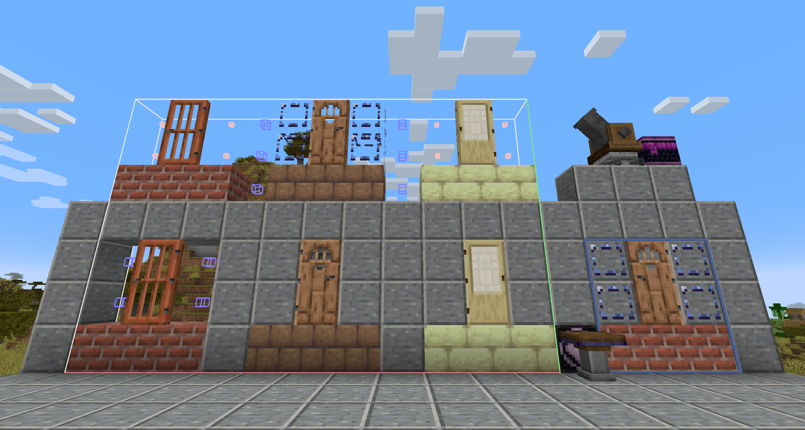

## 蓝图空位
## Create：Blueprint Void

### 简介
### Brief

类似于原版的**结构空位**方块，当使用蓝图大炮打印包含该方块的结构时，无论如何设置蓝图大炮的填充模式，最终打印出来的结构中的蓝图空位对应位置的方块**都不会**被替换

Similar to **structure void** in vanilla mc. When a schematic with blueprint void is printed, the block in accordance **won't be replaced** regardless of selected replace mode.

保存结构时，结构中的结构空位将会被替换为蓝图空位方块（可配置）

When a structure is saved, the structure void in the schematic will be replaced by blueprint void. (Optional, configure it in _[save]/serverconfig/bpvoid-server.toml_)

### 方块属性
### Block Properties

没有碰撞箱，不可以被火把等方块依附，使用方块右键将直接被替换，当其被活塞等推动时会直接被破坏

No Collision, can't be attached by torch etc., will be replaced when right-clicked holding a block, will be destroyed when pushed by a piston.

### 其他信息
### Misc Infos

蓝图空位方块可以通过一个蓝图与笔和脚手架合成（无序合成），放置该方块不会消耗自身

It can be crafted by a schematic and quill with a scaffolding (shapeless), it won't shrink on placed.

该 Mod 也修复了 Create 中蓝图渲染的深度冲突（ z-fighting ）问题

The mod also fixed the z-fighting problem in schematic render.

### 演示效果
### Demonstrations

图片上半部分为保存的结构，下半部分为使用蓝图大炮打印出的结果

The uppers are the structures to save, while the lower are the printed results.

从左到右分别为：
- Create 原版结构中使用结构方块打印效果
- 使用蓝图空位的打印效果
- 安装本 Mod 后结构方块的打印效果
（白色小方块位置为结构方块，蓝色方块位置为空气方块）

From left to right:
- vanilla Create result
- blueprint void printed
- replaced structure void
  (Small white cubes are structure void blocks, blue cubes are air blocks)

最右侧为放置蓝图时的预览效果，可以看到不再有深度冲突问题

Demonstrated on the right-bottom are the schematic render effect, no z-fighting anymore.